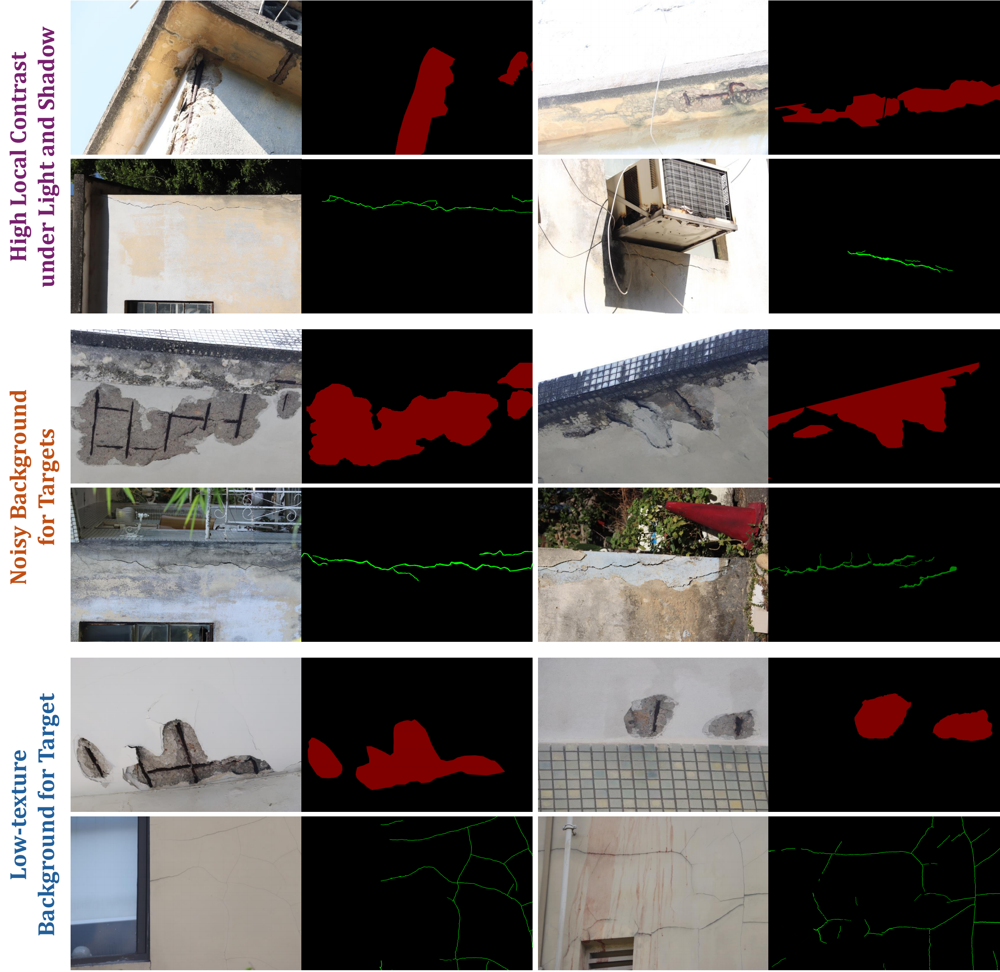
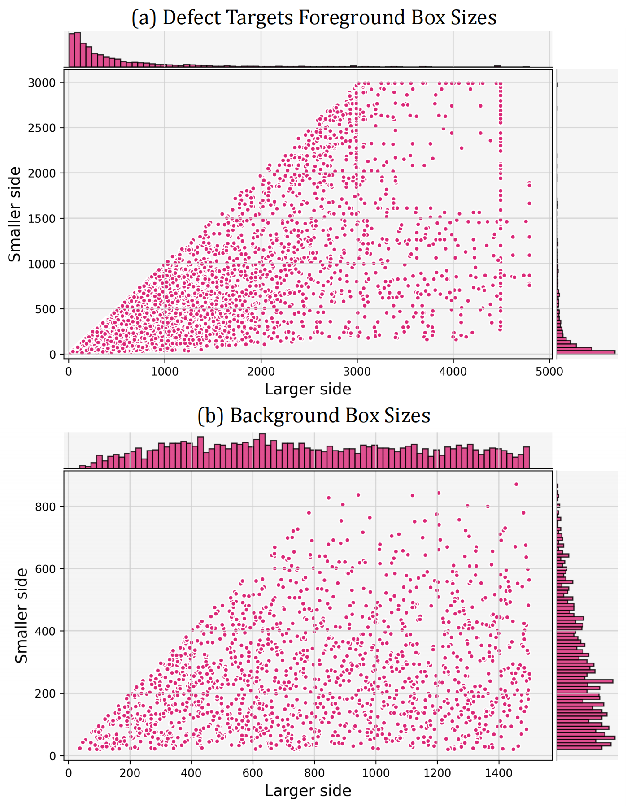
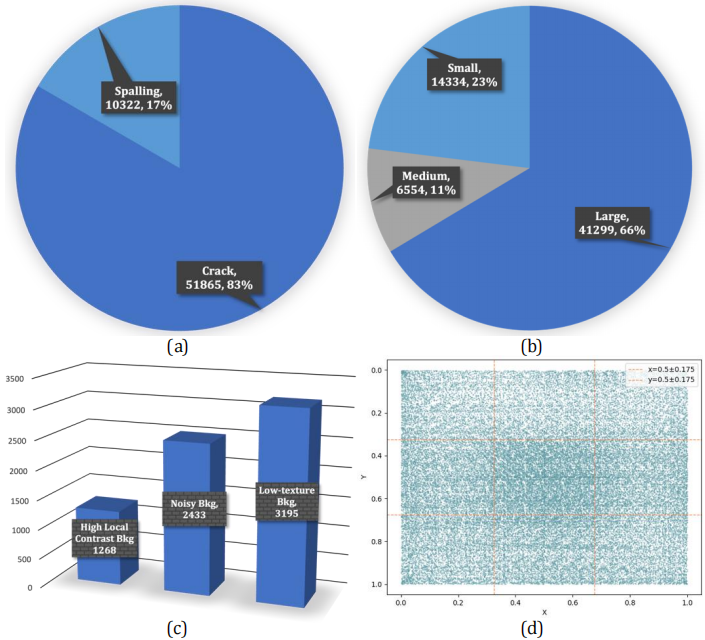

<h1 style="text-align: center; font-size: 35px; font-family: 'Sama Devanagari';"> CUBIT-InSeg Dataset
</h1>

<h3 style="text-align: center; font-size: 28px; font-family: 'Sama Devanagari';"> 
From instance segmentation to physical quantification: High-resolution UAV-based dataset for façade defect assessment.
</h3>

<h3 style="text-align: center; font-size: 21px; font-family: 'Sama Devanagari';"> 
<button style="background-color: #000000; color: white;margin-centre: 15px; padding: 10px 15px;border: none; border-radius: 5px;">
<a href="https://doi.org/10.1016/j.autcon.2026.106980" style="color: white; text-decoration: none;">Automation in Construction 2026</a>
</button>
</h3>

<div style=" text-align: center; font-size: 21px;">
More information about dataset extension and can access at our benchmark challenges page: https://benyunzhao.github.io/CUBIT-Dataset
</div>

<div style=" text-align: center; font-size: 21px;">
CUBIT-InSeg dataset can be available at: 
</div>
<button style="background-color: #000000; color: white; margin: 0 auto; padding: 10px 15px;border: none; border-radius: 5px;">
<a href="https://drive.google.com/drive/folders/1FmRUgr6Wqg5_OP33lZ0cqbiy1D5y67oD?usp=sharing" style="color: white; text-decoration: none;">Google Drive; </a> 
</button>

<button style="background-color: #000000; color: white; margin: 0 auto; padding: 10px 15px;border: none; border-radius: 5px;">
<a href="https://mycuhk-my.sharepoint.com/:f:/g/personal/1155145791_link_cuhk_edu_hk/IgCe3BQI5PlzSop_Lug4hvzKAaQn_h2ICpYIfY2GeAIvYPA?e=7ZWkx2" style="color: white; text-decoration: none;">OneDrive</a> 
</button> (Password of Onedrive link: cubit-inseg)


<div style="text-align: center; font-family: 'American Typewriter'; font-weight: 400; "> 
<h2>Sample images in CUBIT-InSeg</h2>
</div>

<p align="center">
   
</p>

<p align="center">
   
</p>

<p align="center">
   
</p>


## Citation
If you find this project helpful for your research, please consider citing our paper and giving a ⭐.

Any questions or academic discussion, please contact me at: byzhao@mae.cuhk.edu.hk

```BibTex
@article{cubit-inseg,
title = {From instance segmentation to physical quantification: High-resolution UAV-based dataset for façade defect assessment},
journal = {Automation in Construction},
volume = {188},
pages = {106980},
year = {2026},
issn = {0926-5805},
doi = {https://doi.org/10.1016/j.autcon.2026.106980},
author = {Benyun Zhao and Jihan Zhang and Yijun Huang and Xi Chen and Ben M. Chen}
}
```
